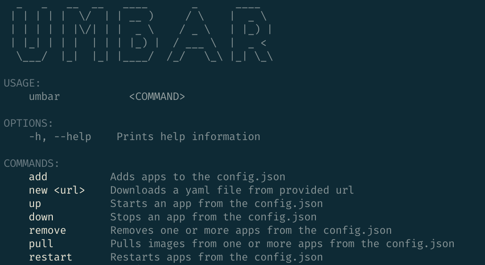

# Introduction

Umbar is a small CLI tool I created to make it simpler to manage my Docker Compose services on my home server.

While it's a personal project, I thought it might be useful to others who manage Docker Compose setups, 
so I decided to open-source it. Feel free to give it a try and share any feedback or ideas!

Usage examples

`umbar add`

Adds the current folder or you can change the folder, it will identify '~' as your user home folder. It will detect if any yaml or yml files exist. If none are located the command will fail, otherwise it will be stored in the config.json for later usage.

`umbar remove`

Removes the entry from the config.json

`umbar restart`

Attempts to run `docker compose restart` and `docker compose log -f` at the location specified in config.json

`umbar pull` 

Attempts to run `docker compose pull` at the location specified in config.json

# Compiling

`dotnet publish Src/Umbar -r linux-x64 -o pub`

-o flag specifies the output folder.

The '-r' specifies the runtime identifier
an example for Windows or Mac

`osx-arm64`

`win-x64`

[Or find others here](https://learn.microsoft.com/en-us/dotnet/core/rid-catalog)

# Spectre console

The primary library used for this application is [Spectre.Console](https://github.com/spectreconsole/spectre.console/)

It is a wonderful library that makes it easy to create cool CLI's, I can highly recommend starring their repository or supporting them!